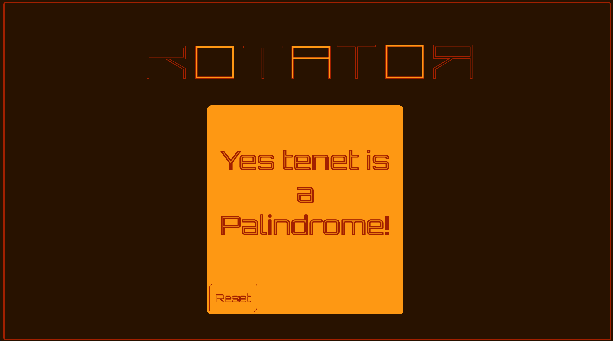
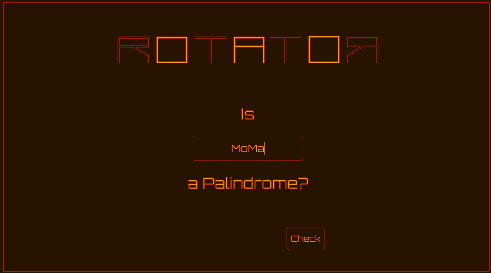
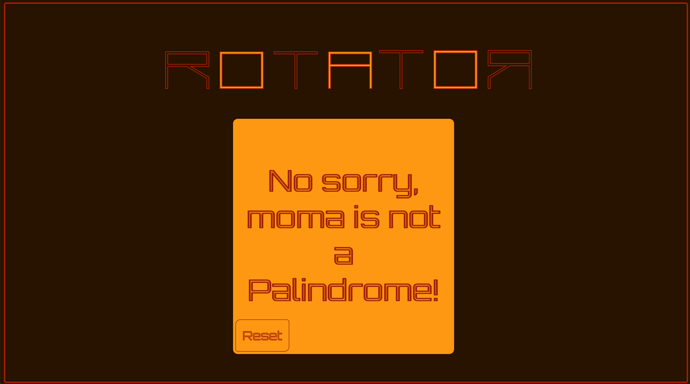

# A Palindrome App

## ⚙️ ⚙️ Description

> ROTATOR is a simplistic JS App that checks if a given word/phrase is a Palindrome.

## 🔬 Close-ups

> If the word/phrase is a palindrome, the screen flips to the following:
>  
> If the word/phrase is not a palindrome, the screen flips to the following:
>  
